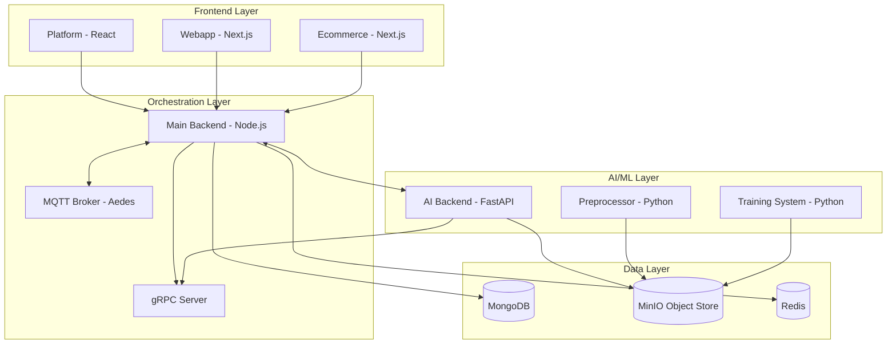

export const metadata = {
  title: 'Architecture - NeuroLab Documentation',
  description: 'Deep dive into the NeuroLab system architecture and component interactions.',
}

# Architecture

NeuroLab is built on a modular, multi-service architecture designed for high-performance neural data processing, real-time feedback, and clinical management.

## System Overview

The system consists of four primary layers that work together to provide multimodal analysis and healthcare services.

## Component Details

### 1. Main Backend (Node.js/Express)
The "Brain" of the business logic. It orchestrates user sessions, manages clinical workflows, and acts as the gatekeeper for data access.
- **Role**: API Gateway, User Auth, Billing, Scheduling.
- **Integrations**: MongoDB, Redis, Flutterwave, MQTT.
- **Internal Communication**: Hosts a gRPC server that AI services query to verify user context without hitting the main database directly for every inference.

### 2. AI Backend (FastAPI)
The "Inference Engine". It handles high-frequency data processing and machine learning predictions.
- **Role**: EEG Analysis, Voice Classification, Mental State Mapping.
- **Worker Process**: Uses Redis Queue (RQ) for asynchronous tasks like report generation or long-running signal analysis.

### 3. Preprocessor (Python)
The "Data Engineering Factory". It prepares raw signals for analysis.
- **Role**: Signal cleaning, artifact removal (EOG/EMG), feature engineering (Band Power, Entropy).
- **Output**: Publishes `dataset_ref` packages used by the Training System.

### 4. Training System (Python)
The "Learning Layer". It evolves the models based on new data.
- **Role**: Background model training, validation, and performance comparison.
- **Artifacts**: Writes model weights and evaluation reports to MinIO.

## Communication Protocols

| Protocol | Usage | Description |
| :--- | :--- | :--- |
| **HTTP/REST** | Internal/External | Standard API interaction for UI and service-to-service calls. |
| **gRPC** | Internal | Low-latency context lookups between AI services and the Main Backend. |
| **MQTT** | IoT/Real-time | Bidirectional communication with EEG headsets and medical sensors. |
| **WebSockets** | Real-time UI | Pushing real-time mental state updates and notifications to the Platform. |

## Data Flow: Real-time Analysis

1. **Ingestion**: EEG sensor data flows in via **MQTT** or **WebSocket**.
2. **Buffering**: The Main Backend buffers raw data and triggers the **AI Backend**.
3. **Preprocessing**: The **Preprocessor** cleans the signal and extracts relevant features.
4. **Inference**: The **AI Backend** classifies the mental state (Relaxed, Focused, Stressed).
5. **Feedback**: Results are sent back to the **Platform** via WebSocket for immediate biofeedback display.
6. **Persistence**: Analyzed sessions and classification results are stored in **MongoDB** for historical tracking.
