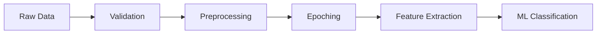

export const metadata = {
  title: 'EEG Signal Processing - NeuroLab Documentation',
  description: 'Learn about the core EEG signal processing pipeline, from raw signal ingestion to feature extraction.',
}

# EEG Signal Processing

NeuroLab employs a state-of-the-art EEG signal processing pipeline designed to handle noisy real-world data and extract meaningful features for mental state classification.

## Pipeline Overview

The EEG processing pipeline consists of five primary stages:

## 1. Signal Quality Validation

Before processing, raw signals undergo a rigorous validation step to ensure data integrity:
- **Missing Data Detection**: Identifying and handling null or infinite values.
- **Signal-to-Noise Ratio (SNR)**: Calculating the ratio of signal power to noise power.
- **Artifact Detection**: Monitoring peak-to-peak amplitude and zero-crossing rates to identify high-amplitude noise or hardware artifacts.
- **Entropy Analysis**: Measuring signal complexity to distinguish between physiological data and flat/repetitive noise.

## 2. Preprocessing & Artifact Removal

EEG signals are extremely low-amplitude (microvolts) and easily contaminated by environmental and physiological noise (EOG, EMG).

### Artifact Cleaning
The system uses automated artifact removal techniques to clean the signal without losing neural information. This includes removing eye blinks, muscle activity, and electrode movement artifacts.

### Filtering
We apply standard digital filters to isolate neural activity:
- **Band-pass Filter (0.5Hz - 45Hz)**: Removes low-frequency drifts and high-frequency noise.
- **Notch Filter (50Hz/60Hz)**: Specifically targets electrical line noise.

## 3. Epoching

Continuous EEG data is segmented into fixed-length windows called **epochs**. 
- **Window Size:** Typically 257 samples (~1.028 seconds at 250Hz).
- **Overlap:** Configurable overlap (e.g., 50%) to ensure continuity in real-time classification.

## 4. Feature Extraction

NeuroLab extracts a comprehensive set of 930+ features per epoch to provide a high-dimensional representation of brain activity.

### Frequency Domain Features (Spectral)
Spectral analysis is the cornerstone of EEG processing. We use Welch's method to compute Power Spectral Density (PSD) and extract power from canonical bands:

| Band | Frequency | Associated Mental States |
| :--- | :--- | :--- |
| **Delta** (δ) | 0.5 - 4 Hz | Deep sleep, unconsciousness |
| **Theta** (θ) | 4 - 8 Hz | Drowsiness, meditation, light sleep |
| **Alpha** (α) | 8 - 13 Hz | Relaxed wakefulness, closed eyes |
| **Beta** (β) | 13 - 30 Hz | Alertness, active thinking, focus |
| **Gamma** (γ) | 30 - 45 Hz | High-level cognitive processing, peak focus |

**Ratios:** We also calculate band power ratios such as **Alpha/Beta** (Relaxation Index) and **Beta/Theta** (Engagement Index).

### Time Domain Features
- **Hjorth Parameters**: Activity, Mobility, and Complexity.
- **Statistical Moments**: Mean, variance, skewness, and kurtosis.
- **Waveform Characteristics**: Zero-crossing rate, RMS, and peak-to-peak amplitude.

### Non-linear & Complex Features
- **Entropy Metrics**: Sample entropy, permutation entropy, and spectral entropy.
- **Phase Synchrony**: Measuring coherence and phase synchronization between different brain regions.
- **Wavelet Transform**: Multi-resolution analysis to capture transient neural events.

## 5. Feature Engineering for ML

The extracted features are further prepared for the machine learning models:
- **Outlier Removal**: Using Isolation Forest to prune anomalous data points.
- **Scaling**: Robust or Standard scaling to normalize feature ranges.
- **Class Balancing**: Applying SMOTE or ADASYN to handle imbalance in mental state datasets.
- **Feature Selection**: Selecting the most discriminative features using F-classif and Mutual Information.

---

## Next Steps

Learn how these features are combined with voice data for multimodal analysis:

  <a
    href='/docs/concepts/voice-emotion'
    className='hover:bg-accent block rounded-lg border p-6 transition-colors'
  >
    <h3 className='mb-2 font-bold'>Voice Emotion Detection →</h3>
    

      Analyze audio for emotional features
    

  </a>
  <a
    href='/docs/concepts/multimodal'
    className='hover:bg-accent block rounded-lg border p-6 transition-colors'
  >
    <h3 className='mb-2 font-bold'>Multimodal Analysis →</h3>
    

      Combining brain and voice data
    

  </a>

